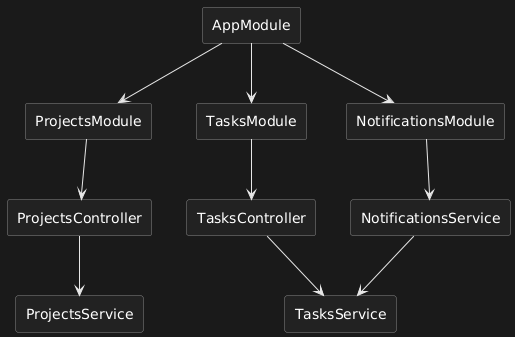
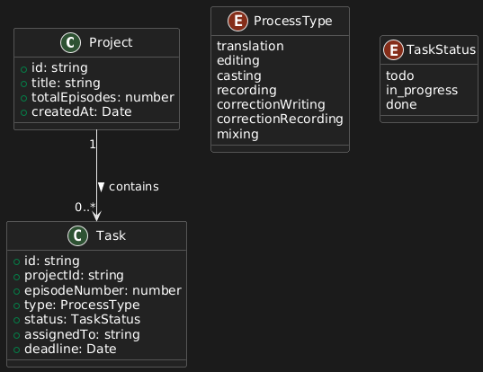

# NodeJS-Course3
Repository for NodeJS Discipline


# Goal
Create useful API to manage processes in fandub projects and tasks. Add, Remove and Update projects; Remind about deadlines and when task of one department is done and can be passed to another department.

# Technologies
- NodeJS
- NestJS
- TypeScript
- PrismaORM
- PostgreSQL

# How to run the project

### 1. Install dependencies

```npm install```

### 2. Start PostgreSQL in Docker

Run PostgreSQL container:

```
docker run --name <container name> -e POSTGRES_PASSWORD=<password> -e POSTGRES_DB=<db name> -p 5432:5432 -d postgres
```

### 3. Configure environment variables

Create `.env` file in the root directory with the following content:

```
DATABASE_URL="postgresql://postgres:<password>@localhost:5432/<db name>?schema=public"
```

### 4. Run database migrations and generate Prisma Client

```
npx prisma migrate dev --name init
npx prisma generate
```

### 5. Start the application

```npm run start```


# Components Diagram


# Data Diagram


# Scenarios
### 1. Creating a project
- User makes `/POST` request with _title name_ and _number of episodes_ in body. 
- A new **Project** record is added.
- The system automatically creates **Task** records for each episode and each process stage.
- Each task gets:
    - `type = translation|editing|casting|recording|correctionWriting|correctionRecording|mixing`
    - `status = todo`
    - `projectId` referencing the created project.

**Data updates:** new Project + multiple Tasks.

---

### 2. Changing the stage of a task
- User makes `/PATCH` request to update task status with _status name_ in body.
- The system updates the task `status` (`todo → in_progress → done`).
- If the stage is completed, the system may:
    - Notify, that the next stage can be started.

**Data updates:** task field `status` are modified.

---

### 3. Assigning work to users
- User makes `/PATCH` request to assign a task with _userName_ in body.
- The system updates the `assignedTo` field.
- The `status` may change to `in_progress`.

**Data updates:** task field `assignedTo` are modified.

---

### 4. Deadlines and reminders
- A scheduler checks deadlines once a day:
- If `deadline < now` and `status != done`, the task becomes overdue.
- The system may notify about delay.

---

### 5. Data aggregation
- User makes `/GET` request for `\project\:id\progress` to get project progress.
  - **Project progress:** `completedTasks / totalTasks`
- User makes `/GET` request for `\project\:id\episodes\:number\progress` to get progress for a specific episode.
  - **Episode progress:** `completedTasksForEpisode / totalTasksForEpisode`


# Tests 
## Unit and Integration Tests
### To run tests:
You need additional database for testing. Create another PostgreSQL container in Docker or database for tests. And after that, create `.env.test` file in the root directory with `DATABASE_URL` pointing to test database.

Then run:

```npm test```

## E2E Tests
### To run E2E tests:
You need additional database for E2E testing. Create another PostgreSQL container in Docker or database for E2E tests. And after that, create `.env.e2e` file in the root directory with `DATABASE_URL` pointing to E2E test database.

Then run:

```npm run test:e2e```

## Mutation Tests
### Mutation Tests Report:
[Mutation Tests Report by Stryker](./reports/mutation/mutation.html)

As it seen from the report, the mutation score is 94.12% for the covered tests for Task Service. This indicates a good level of test effectiveness, as a higher mutation score generally reflects better test coverage and quality. But still not 100%, because it mutated some parts of code that are not affects on service work as returning undefined which is possible case if where is no record found in the database.


# URL on server
https://nodejs-course3.onrender.com


#### _Author: Kaliberda Anton Dmytrovych, student of FICT IM-32_

